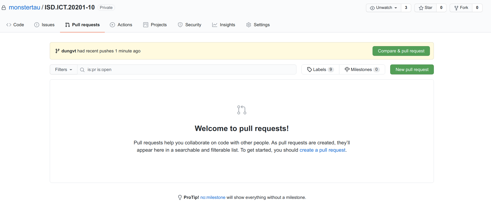
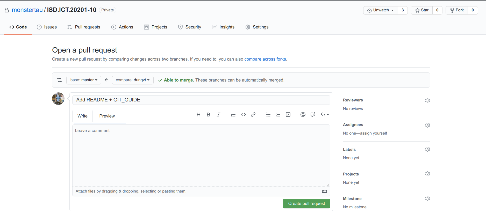
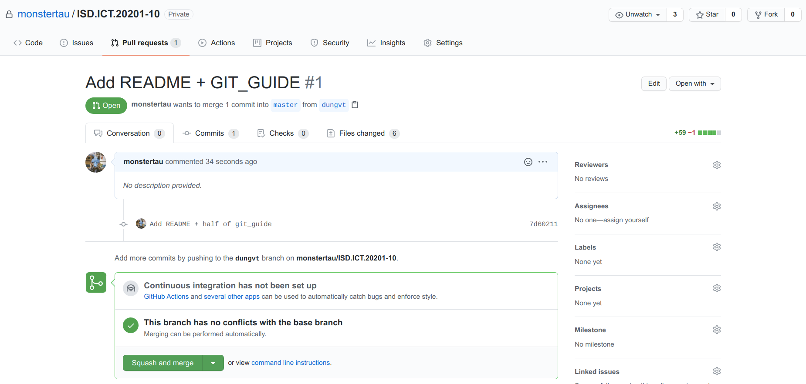

# GIT GUIDE FOR TEAM

### 1. Clone repository:
- Terminal
~~~bash
git clone https://github.com/monstertau/ISD.ICT.20201-10.git
~~~

### 2. After clone, create your own branch:
- Terminal

~~~bash
cd ISD.ICT.20201-10
git checkout -b <YourShortName>
~~~

For example `git checkout dungvt`.

### 3. Add changes and commit
**Before commit, remember to check that you are in your own branch**

- Terminal:
~~~bash
git add <file-to-add>
git commit -m "<commit message, what was changed?>"
~~~
### 4. Push to your branch

You must merge your branch with remote changes before pushing.
- Terminal
~~~bash
# Switch to master:
git checkout master

# Sync the lastest changes (from teammates):
git pull

# Switch to your branch:
git checkout <YourName>

# Merge changes from master:
git merge master

~~~
Then push to your branch after commiting changes:
- Terminal
~~~bash
git push origin <YourBranch>
~~~
After pushing changes to your branch, create **Pull Request** to merge branch from your branch to master branch :
- Choose **Pull Request** Tab,then click to New pull request

- After that, a new **Open a pull request** window will open. In here write out title of your pull request, and click **Create pull request**

- All Done! Now every commit to your branch will be tracked to this pull request, and remember to remind your team members to review code and accept merge request to master branch
