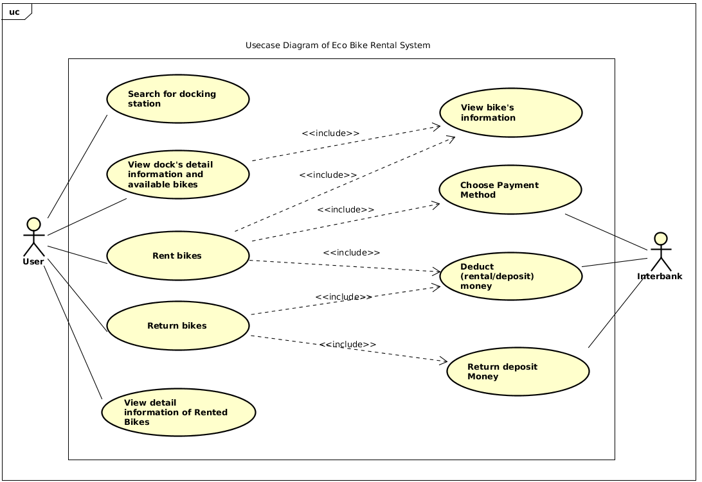
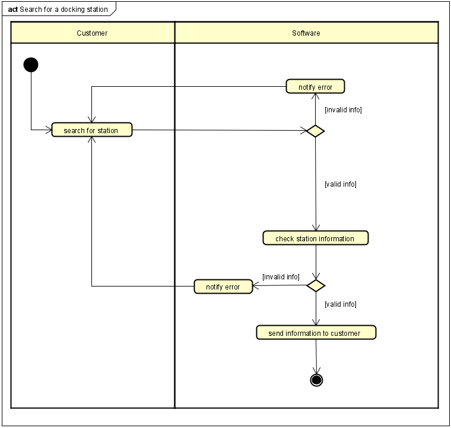
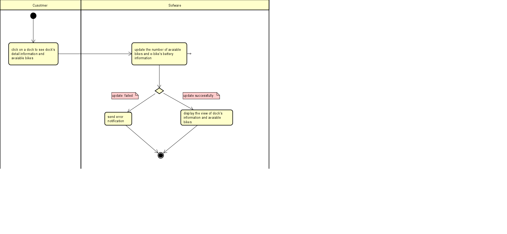
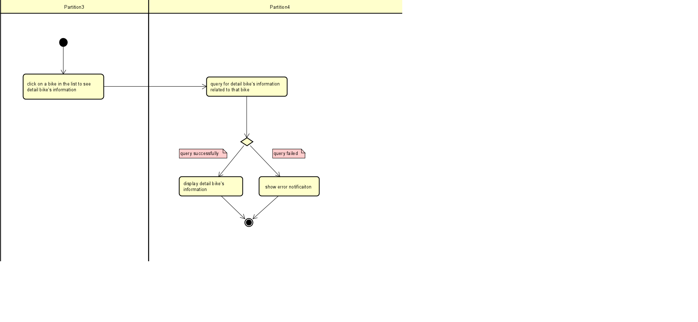
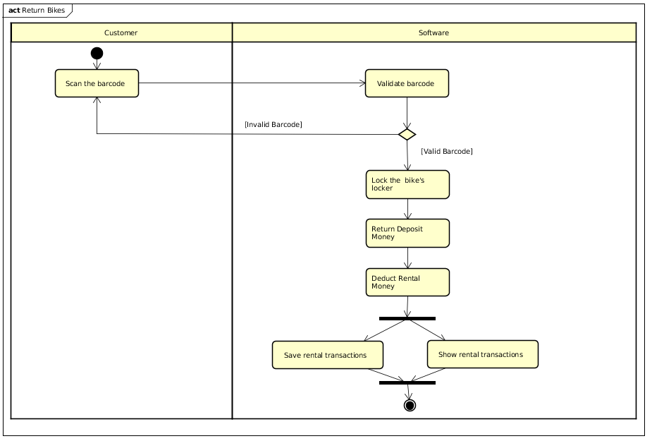
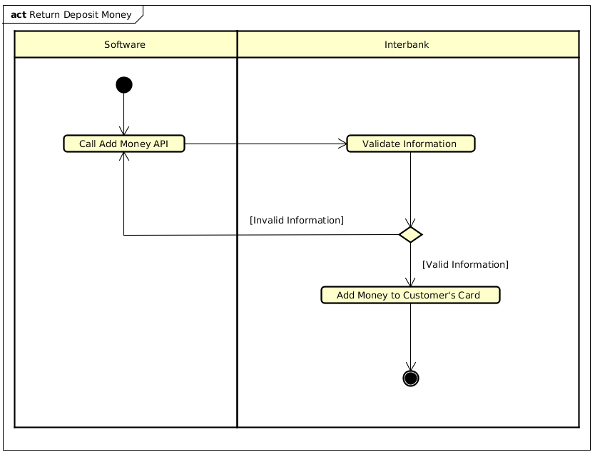
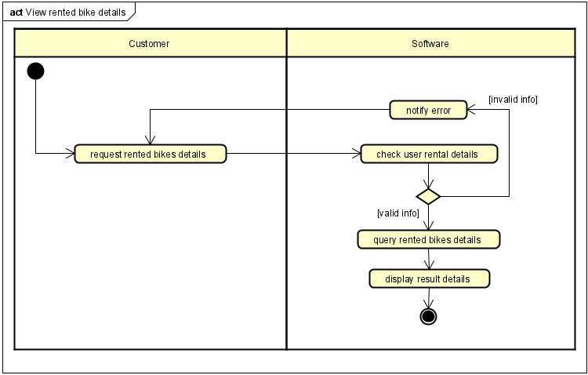

# Software Development Homework 01
Homework week 01 of Team 10 -  ITSS Software Development Course
## 1. Work Assignment
- **Vu Trung Dung**
    + Redraw Use Case Diagram base on the agreement and meeting between team member.
    + Write Flow Of Events and Activity Diagram of Use Case:
        + Return Bikes
        + Return Deposit Money
    + Refactor files
- **Nguyen Xuan Hoang**
    + Write Flow Of Events and Activity Diagram of Use Case:
        + Rent Bikes
        + Choose Payment Method
        + Deduct Money

- **Nguyen Trung Nghia**
    + Write Flow Of Events and Activity Diagram of Use Case:
        + View Dock's Detail Infomation
        + View Bike's Information
- **Nguyen Ngoc Quy**
    + Write Flow Of Events and Activity Diagram of Use Case:
        + Search for docking station
        + View detail information of rented bikes
## 2. Work Sumary
### 2.1. Use case Diagram 

### 2.2. Flow Of Events
#### Search for docking station & View Rented Bike Details
[Flow Of Events](./NguyenNgocQuy/Flow-of-events.pdf)
#### View Dock's Information & View Bike's Information
[Flow Of Events](./NguyenTrungNghia/FlowOfEvents.pdf)
#### Rent Bikes, Choose Payment Method & Deduct Money
[Flow Of Events]()
#### Return Bikes, Return Deposit Money
[Flow Of Events](./VuTrungDung/Flow-Of-Events.png)

### 2.3. Activity Diagram
#### Search for docking station

#### View Dock's Information

#### View Bike's Information

#### Rent Bikes

#### Choose Payment Method

#### Deduct Money

#### Return Bikes

#### Return Deposit Money

#### View Rented Bikes' Detail Information

